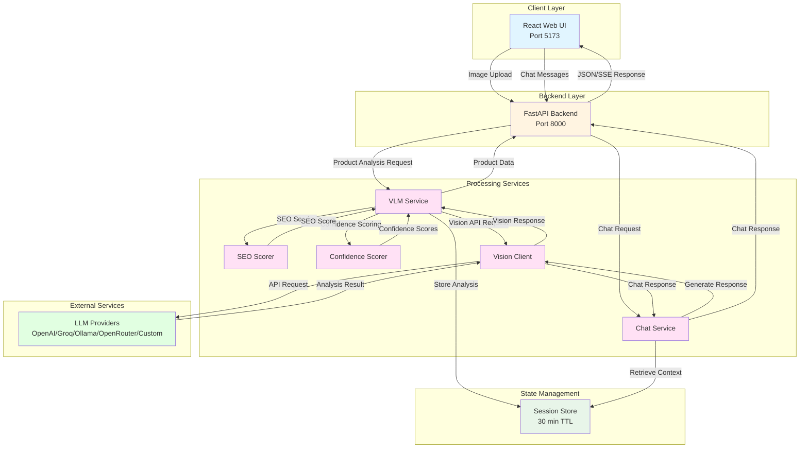

<p align="center">
  
</p>

# 🛍️ VisiSense - CatalogIQ

AI-powered visual product intelligence for retail merchandising teams using multi-provider vision models.

---

## 📋 Table of Contents

- [Project Overview](#project-overview)
- [Architecture](#architecture)
- [Get Started](#get-started)
  - [Prerequisites](#prerequisites)
  - [Quick Start](#quick-start)
- [Project Structure](#project-structure)
- [Usage Guide](#usage-guide)
- [LLM Provider Configuration](#llm-provider-configuration)
- [Environment Variables](#environment-variables)
- [Technology Stack](#technology-stack)
- [Troubleshooting](#troubleshooting)
- [License](#license)

---

## Project Overview

**VisiSense - CatalogIQ** is an intelligent visual product analysis platform that processes product images to generate comprehensive retail catalog content with AI-powered vision models, SEO optimization, and an interactive chat interface for product insights.

### How It Works

1. **Image Upload & Analysis**: Users upload 1-5 product images. The system analyzes visual features using state-of-the-art vision models.
2. **Content Generation**: AI automatically generates SEO-optimized titles, descriptions, feature highlights, and product attributes.
3. **Quality Scoring**: Real-time SEO quality assessment with actionable recommendations and confidence scoring for each attribute.
4. **Interactive Chat**: Users can ask questions about products using a natural language chat interface powered by the analyzed product data.

The platform supports multiple LLM providers (OpenAI, Groq, Ollama, OpenRouter, or any OpenAI-compatible API), allowing teams to choose the best option for their deployment needs. The backend maintains session-based caching for fast chat responses, and provides real-time processing updates via Server-Sent Events.

---

## Architecture

This application uses a microservices architecture where the React frontend communicates with a FastAPI backend that orchestrates vision analysis, content generation, SEO scoring, and chat functionality. The backend integrates with multiple LLM providers through a universal vision client, enabling flexible deployment options across cloud APIs and local models.



**Service Components:**

1. **React Web UI (Port 5173)** - Provides drag-and-drop image upload interface, real-time processing status with Server-Sent Events, interactive product data visualization, and chat interface for product Q&A

2. **FastAPI Backend (Port 8000)** - Handles API routing, orchestrates processing services, manages sessions, and serves JSON/SSE responses to the frontend

3. **VLM Service** - Orchestrates vision analysis workflow, coordinates with Vision Client for image analysis, invokes SEO and Confidence scoring, and generates structured product data

4. **Chat Service** - Provides context-aware conversational interface using stored product analysis data from Session Store

5. **Vision Client** - Universal adapter supporting multiple LLM providers (OpenAI, Groq, Ollama, OpenRouter, custom APIs) for vision analysis and chat generation

6. **SEO Scorer** - Evaluates content quality with 0-100% scoring, identifies optimization opportunities, and provides actionable recommendations

7. **Confidence Scorer** - Evaluates attribute extraction confidence levels based on visual evidence clarity

8. **Session Store** - In-memory state management with 30-minute TTL for chat sessions and product analysis data

**Typical Flow:**

1. User uploads product images through the web UI
2. Backend processes images and sends them to the VLM Service
3. VLM Service requests vision analysis from the Vision Client
4. Vision Client calls the configured LLM provider (OpenAI, Groq, Ollama, etc.)
5. LLM provider analyzes images and returns structured product data
6. VLM Service applies SEO scoring and confidence evaluation
7. Product analysis is stored in Session Store and returned to the user
8. User can chat with the product using the Chat Service
9. Chat Service retrieves context from Session Store and generates responses via Vision Client
10. Responses are streamed back to the user in real-time

---

## Get Started

### Prerequisites

Before you begin, ensure you have the following installed and configured:

- **Docker and Docker Compose** (v20.10+)
  - [Install Docker](https://docs.docker.com/get-docker/)
  - [Install Docker Compose](https://docs.docker.com/compose/install/)
- **LLM Provider Access** (choose one):
  - [OpenAI API Key](https://platform.openai.com/account/api-keys) (Recommended)
  - [Groq API Key](https://console.groq.com/keys) (Fast & Free Tier)
  - [Ollama Local Installation](https://ollama.com) (Private/Local)
  - [OpenRouter API Key](https://openrouter.ai/keys) (Multi-Model)
  - Any OpenAI-compatible API endpoint

#### Verify Installation

```bash
# Check Docker
docker --version
docker compose version

# Verify Docker is running
docker ps
```

### Quick Start (Docker Deployment)

**Recommended for most users - runs everything in containers**

#### 1. Clone or Navigate to Repository

```bash
# If cloning:
git clone  https://github.com/cld2labs/VisiSense.git
cd VisiSense
```

#### 2. Configure Backend Environment

Copy the example configuration and add your API key:

```bash
# Copy backend environment template
cp backend/.env.example backend/.env

# Edit the file and add your API key
nano backend/.env
```

Update `backend/.env` with your LLM provider credentials:

```bash
LLM_PROVIDER=openai
LLM_API_KEY=your_actual_api_key_here
LLM_BASE_URL=https://api.openai.com/v1
LLM_MODEL=gpt-4o
```

**For other providers**, see [LLM Provider Configuration](#llm-provider-configuration) section.

#### 3. Launch the Application

```bash
# Build and start all services
docker compose up -d --build

# View logs (optional)
docker compose logs -f
```

#### 4. Access the Application

Once containers are running:

- **Frontend UI**: http://localhost:5173
- **Backend API**: http://localhost:8001
- **API Documentation**: http://localhost:8001/docs

#### 5. Verify Services

```bash
# Check health status
curl http://localhost:8001/health

# Or use the health check script
bash scripts/health-check.sh
```

#### 6. Stop the Application

```bash
docker compose down
```

---

### Local Development Setup

**For developers who want to run services locally without Docker**

#### 1. Prerequisites

- Python 3.11+
- Node.js 20+
- Your chosen LLM provider API key

#### 2. Backend Setup

```bash
cd backend

# Create virtual environment
python -m venv venv
source venv/bin/activate  # On Windows: venv\Scripts\activate

# Install dependencies
pip install -r requirements.txt

# Configure environment
cp .env.example .env
nano .env  # Add your API key

# Start backend
uvicorn main:app --reload --port 8000
```

Backend will run on `http://localhost:8000`

#### 3. Frontend Setup

Open a new terminal:

```bash
cd frontend

# Install dependencies
npm install

# Configure environment for local development
cp .env.example .env

# Edit .env and set:
# VITE_API_URL=http://localhost:8000
nano .env

# Start frontend
npm run dev
```

Frontend will run on `http://localhost:5173`

#### 4. Access the Application

- **Frontend**: http://localhost:5173
- **Backend API**: http://localhost:8000
- **API Docs**: http://localhost:8000/docs

**Note**: For local development, the frontend `.env` file **must** contain:
```bash
VITE_API_URL=http://localhost:8000
```

This tells the frontend where to find the backend API.

---

## Project Structure

```
VisiSense/
├── backend/
│ ├── routers/
│ │ ├── catalog.py          # Product analysis endpoints
│ │ └── chat.py              # Chat endpoints
│ ├── services/
│ │ ├── vision_client.py     # Universal LLM provider client
│ │ ├── vlm_service.py       # Vision analysis orchestration
│ │ ├── chat_service.py      # Chat service with product context
│ │ ├── confidence_scorer.py # Attribute confidence evaluation
│ │ ├── seo_scorer.py        # SEO quality assessment
│ │ ├── session_store.py     # Session management
│ │ └── prompt_engine.py     # Prompt generation
│ ├── models/
│ │ └── schemas.py           # Pydantic data models
│ ├── utils/
│ │ ├── image_utils.py       # Image processing utilities
│ │ └── validation.py        # Input validation
│ ├── main.py                # FastAPI application entry point
│ ├── config.py              # Environment configuration
│ ├── requirements.txt       # Python dependencies
│ └── Dockerfile            # Backend container
├── frontend/
│ ├── src/
│ │ ├── pages/
│ │ │ └── HomePage.tsx       # Main product analysis page
│ │ ├── components/
│ │ │ └── ui/                # Reusable UI components
│ │ ├── services/
│ │ │ └── api.ts             # API client utilities
│ │ └── types/               # TypeScript type definitions
│ ├── package.json          # npm dependencies
│ ├── vite.config.ts        # Vite configuration
│ └── Dockerfile           # Frontend container
├── scripts/
│ ├── setup.sh              # Environment setup script
│ └── health-check.sh       # Service health verification
├── docker-compose.yml      # Service orchestration
├── .env.example            # Environment variable template
└── README.md              # Project documentation
```

---

## Usage Guide

### Using VisiSense - CatalogIQ

1. **Open the Application**
   - Navigate to `http://localhost:5173`

2. **Upload Product Images**
   - **Drag & Drop**: Drag 1-5 product images into the upload zone
   - **Click to Browse**: Click the upload area to select files
   - **Supported Formats**: JPG, PNG, WEBP (max 10MB each)

3. **Analyze Product**
   - Click "Analyze Product" button
   - Watch real-time processing status
   - Wait for AI analysis to complete

4. **Review Generated Content**
   - **Product Identity**: Category, subcategory, price positioning
   - **SEO Content**: Optimized title, short and long descriptions
   - **SEO Quality Score**: 0-100% score with grade (A, B+, B, C, D)
   - **Product Attributes**: Material, color, style, finish, etc. with confidence scores
   - **Feature Highlights**: 5-7 benefit-driven bullet points
   - **SEO Keywords**: Primary and long-tail keyword suggestions
   - **SKU Intelligence**: Suggested SKU format and variant signals

5. **SEO Optimization**
   - Review SEO score and identified issues
   - Click "Quick Fix" on individual issues for instant improvements
   - Use "Auto-Enhance SEO" for comprehensive optimization
   - Click "Regenerate" to rewrite content with custom instructions

6. **Chat with Your Product**
   - Use suggested questions or ask your own
   - Get context-aware answers based on product analysis
   - Examples:
     - "Who is the target customer for this product?"
     - "What materials is this made from?"
     - "What occasions is this suitable for?"
     - "What are the key selling points?"

7. **Export Results**
   - Click "Export to JSON" button
   - Save complete product data for your catalog system

### Performance Tips

- **Multi-Image Analysis**: Upload multiple angles for better accuracy
- **Clear Images**: Use well-lit, high-resolution product photos
- **Brand Recognition**: Products with visible branding get better SEO scores
- **Session Persistence**: Chat sessions expire after 30 minutes of inactivity
- **Regeneration**: Use specific instructions for better regeneration results

---

## LLM Provider Configuration

VisiSense supports multiple LLM providers. Choose the one that best fits your needs:

### OpenAI (Recommended for Production)

**Best for**: Highest quality outputs, production deployments

- **Get API Key**: https://platform.openai.com/account/api-keys
- **Models**: `gpt-4o`, `gpt-4-turbo`, `gpt-4o-mini`
- **Pricing**: Pay-per-use (check [OpenAI Pricing](https://openai.com/pricing))
- **Configuration**:
  ```bash
  LLM_PROVIDER=openai
  LLM_API_KEY=sk-...
  LLM_BASE_URL=https://api.openai.com/v1
  LLM_MODEL=gpt-4o
  ```

### Groq (Fast & Free Tier)

**Best for**: Fast inference, development, free tier testing

- **Get API Key**: https://console.groq.com/keys
- **Models**: `llama-3.2-90b-vision-preview`, `llama-3.2-11b-vision-preview`
- **Free Tier**: 30 requests/min, 6,000 tokens/min
- **Pricing**: Very competitive paid tiers
- **Configuration**:
  ```bash
  LLM_PROVIDER=groq
  LLM_API_KEY=gsk_...
  LLM_BASE_URL=https://api.groq.com/openai/v1
  LLM_MODEL=llama-3.2-90b-vision-preview
  ```

### Ollama (Local & Private)

**Best for**: Local deployment, privacy, no API costs, offline operation

- **Install**: https://ollama.com/download
- **Pull Model**: `ollama pull qwen2.5-vl:7b`
- **Models**: `qwen2.5-vl:7b`, `llama3.2-vision:11b`, `llama3.2-vision:90b`, `bakllava`
- **Pricing**: Free (local hardware costs only)
- **Configuration**:
  ```bash
  LLM_PROVIDER=ollama
  LLM_API_KEY=  # Leave empty - no API key needed
  LLM_BASE_URL=http://localhost:11434/v1
  LLM_MODEL=qwen2.5-vl:7b
  ```
- **Setup**:
  ```bash
  # Install Ollama
  curl -fsSL https://ollama.com/install.sh | sh

  # Pull vision model
  ollama pull qwen2.5-vl:7b

  # Verify it's running
  curl http://localhost:11434/api/tags
  ```

### OpenRouter (Multi-Model Access)

**Best for**: Access to multiple models through one API, model flexibility

- **Get API Key**: https://openrouter.ai/keys
- **Models**: Claude, Gemini, GPT-4, Llama, and 100+ others
- **Pricing**: Varies by model
- **Configuration**:
  ```bash
  LLM_PROVIDER=openrouter
  LLM_API_KEY=sk-or-...
  LLM_BASE_URL=https://openrouter.ai/api/v1
  LLM_MODEL=anthropic/claude-3-haiku
  ```

### Custom OpenAI-Compatible API

**Best for**: Custom deployments, internal APIs, alternative providers

Any API that implements the OpenAI chat completions format will work:

```bash
LLM_PROVIDER=custom
LLM_API_KEY=your_api_key
LLM_BASE_URL=https://your-custom-endpoint.com/v1
LLM_MODEL=your-model-name
```

### Switching Providers

To switch providers, simply update `backend/.env` and restart:

```bash
# Edit configuration
nano backend/.env

# Restart backend only
docker compose restart backend

# Or restart all services
docker compose down
docker compose up -d
```

---

## Environment Variables

Configure the application behavior using environment variables in `backend/.env`:

### Core LLM Configuration

| Variable | Description | Default | Type |
|----------|-------------|---------|------|
| `LLM_PROVIDER` | LLM provider name (openai, groq, ollama, openrouter, custom) | `openai` | string |
| `LLM_API_KEY` | API key for the provider (empty for Ollama) | - | string |
| `LLM_BASE_URL` | Base URL for the LLM API | `https://api.openai.com/v1` | string |
| `LLM_MODEL` | Model name to use for vision analysis | `gpt-4o` | string |

### Generation Parameters

| Variable | Description | Default | Type |
|----------|-------------|---------|------|
| `TEMPERATURE` | Model creativity level (0.0–1.0, lower = deterministic) | `0.3` | float |
| `MAX_TOKENS` | Maximum tokens per response | `2048` | integer |
| `MAX_RETRIES` | Number of retry attempts for API failures | `3` | integer |
| `REQUEST_TIMEOUT` | Request timeout in seconds | `120` | integer |

### File Upload Limits

| Variable | Description | Default | Type |
|----------|-------------|---------|------|
| `MAX_IMAGE_SIZE_MB` | Maximum image file size in MB | `10` | integer |
| `MAX_IMAGES_PER_REQUEST` | Maximum images per analysis | `5` | integer |
| `ALLOWED_IMAGE_TYPES` | Allowed MIME types (comma-separated) | `image/jpeg,image/png,image/webp` | list |

### Session Management

| Variable | Description | Default | Type |
|----------|-------------|---------|------|
| `CHAT_SESSION_TTL_MINUTES` | Session expiration time in minutes | `30` | integer |
| `CHAT_MAX_HISTORY_TURNS` | Maximum chat history length | `10` | integer |

### Server Configuration

| Variable | Description | Default | Type |
|----------|-------------|---------|------|
| `SERVICE_PORT` | Backend service port | `8000` | integer |
| `PYTHON_ENV` | Environment mode (development/production) | `development` | string |
| `CORS_ORIGINS` | Allowed CORS origins (comma-separated or *) | `http://localhost:3000,http://localhost:5173` | list |

**Example .env file** is available at `.env.example` in the repository root.

---

## Inference Metrics

The table below compares inference performance for the complete VisiSense catalog generation workflow (averaged over 3 runs with the same product image).

| Provider     | Model      | Deployment      | Context Window | Avg Input Tokens | Avg Output Tokens | Avg Tokens / Request | P50 Latency (ms) | P95 Latency (ms) | Throughput (req/s) | Hardware        |
| ------------ | ---------- | --------------- | -------------- | ---------------- | ----------------- | -------------------- | ---------------- | ---------------- | ------------------ | --------------- |
| OpenAI (Cloud) | `gpt-4o` | API (Cloud)     | 128K           | 3,443            | 686.67            | 4,129.67             | 10,176           | 11,247           | 0.101              | N/A             |

> **Notes:**
>
> - All metrics use the actual VisiSense production prompt (~2,678 tokens) and production image processing pipeline.
> - Input tokens include both the prompt and image processing overhead (765 tokens per high-detail image in GPT-4o).
> - Output tokens represent the complete JSON catalog response with all fields populated (product identity, SEO content, features, attributes, keywords, SKU intelligence).
> - Token counts are estimated using ~4 characters per token. Actual API token usage may vary slightly.

---

## Model Capabilities

### GPT-4o

OpenAI's flagship multimodal model for vision and language understanding, accessible via cloud API.

| Attribute                   | Details                                                                                                                                                                                    |
| --------------------------- | ------------------------------------------------------------------------------------------------------------------------------------------------------------------------------------------ |
| **Parameters**              | Not publicly disclosed                                                                                                                                                                     |
| **Architecture**            | Multimodal Transformer (text + image input, text output)                                                                                                                                   |
| **Context Window**          | 128,000 tokens input                                                                                                                                                                       |
| **Vision Capabilities**     | State-of-the-art image understanding with brand/logo recognition, object detection, and detailed attribute extraction                                                                       |
| **Structured Output**       | JSON mode with schema validation — generates complete product catalogs with consistent formatting                                                                                           |
| **Use Case in VisiSense**   | Processes product images to generate comprehensive e-commerce catalog content including SEO-optimized titles, descriptions, features, attributes, keywords, and SKU intelligence            |
| **Image Processing**        | High-detail mode: 765 tokens per image. Supports 1-5 images per request for multi-angle product analysis                                                                                   |
| **Output Quality**          | 659-706 tokens per catalog (stable output), 100% success rate in testing                                                                                                                   |
| **Pricing**                 | $2.50 / 1M input tokens, $10.00 / 1M output tokens (~$0.0185 per product catalog)                                                                                                          |
| **License**                 | Proprietary (OpenAI Terms of Use)                                                                                                                                                          |
| **Deployment**              | Cloud-only — OpenAI API or Azure OpenAI Service. No self-hosted or on-prem option                                                                                                          |
| **Knowledge Cutoff**        | October 2023                                                                                                                                                                               |

---

## Technology Stack

### Backend
- **Framework**: FastAPI (Python web framework with async support)
- **AI / LLM**: Multi-provider support
  - OpenAI GPT-4o (vision analysis and chat)
  - Groq Llama-3.2-vision (fast inference)
  - Ollama LLaVA (local deployment)
  - OpenRouter (multi-model access)
  - Custom OpenAI-compatible APIs
- **Vision Processing**:
  - Base64 image encoding
  - Multi-image analysis support
  - Attribute confidence scoring
- **Content Generation**:
  - SEO-optimized titles and descriptions
  - Keyword extraction and optimization
  - SKU intelligence
- **State Management**:
  - In-memory session store
  - 30-minute session TTL
  - Session-based chat history
- **Async Server**: Uvicorn (ASGI)
- **Config Management**: Pydantic Settings with python-dotenv

### Frontend
- **Framework**: React 18 with TypeScript
- **Build Tool**: Vite (fast bundler)
- **Styling**: Tailwind CSS + PostCSS
- **UI Components**: Custom design system with Lucide React icons
- **State Management**: React hooks (useState)
- **File Upload**: react-dropzone
- **API Communication**:
  - Axios for REST calls
  - Fetch API for Server-Sent Events (SSE)
- **Export**: JSON download

### Infrastructure
- **Containerization**: Docker + Docker Compose
- **Frontend Server**: Nginx (unprivileged)
- **Reverse Proxy**: Nginx proxy for API routes
- **Health Checks**: Docker health monitoring
- **Networking**: Docker bridge network

---

## Troubleshooting

For comprehensive troubleshooting guidance, common issues, and solutions, refer to:

[Troubleshooting Guide - TROUBLESHOOTING.md](./TROUBLESHOOTING.md)

### Quick Debug

**Check service health:**
```bash
curl http://localhost:8000/health
docker compose ps
```

**View logs:**
```bash
docker compose logs backend --tail 50
docker compose logs frontend --tail 50
```

**Enable debug mode:**
```bash
# Update backend/.env
LOG_LEVEL=DEBUG

# Restart backend
docker compose restart backend
```

---

## License

This project is licensed under the terms specified in [LICENSE.md](./LICENSE.md) file.

---

## Disclaimer

**VisiSense - CatalogIQ** is provided as-is for product analysis and catalog generation purposes. While we strive for accuracy:

- Always review AI-generated content before publication
- Verify product attributes and descriptions for accuracy
- Do not rely solely on AI for critical product information
- Test thoroughly before using in production environments
- Consult subject matter experts for product-specific details

For full disclaimer details, see [DISCLAIMER.md](./DISCLAIMER.md)

---
