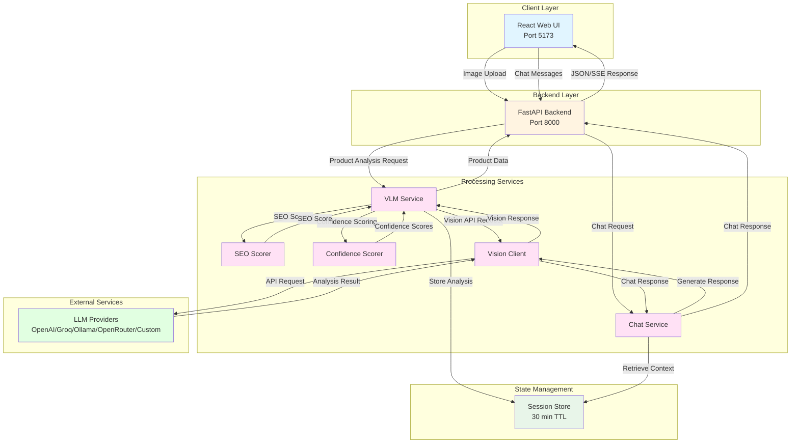

<p align="center">
  
</p>

# VisiSense — CatalogIQ

AI-powered visual product intelligence platform that converts product images into comprehensive retail catalog content. Upload images, select your LLM provider, and generate SEO-optimized titles, descriptions, attributes, and keywords using state-of-the-art vision models — powered by any OpenAI-compatible API or a locally running Ollama model.

---

## Table of Contents

- [VisiSense — CatalogIQ](#visisense--catalogiq)
  - [Table of Contents](#table-of-contents)
  - [Project Overview](#project-overview)
  - [How It Works](#how-it-works)
  - [Architecture](#architecture)
    - [Architecture Diagram](#architecture-diagram)
    - [Architecture Components](#architecture-components)
    - [Service Components](#service-components)
    - [Typical Flow](#typical-flow)
  - [Get Started](#get-started)
    - [Prerequisites](#prerequisites)
      - [Verify Installation](#verify-installation)
    - [Quick Start (Docker Deployment)](#quick-start-docker-deployment)
      - [1. Clone the Repository](#1-clone-the-repository)
      - [2. Configure the Environment](#2-configure-the-environment)
      - [3. Build and Start the Application](#3-build-and-start-the-application)
      - [4. Access the Application](#4-access-the-application)
      - [5. Verify Services](#5-verify-services)
      - [6. Stop the Application](#6-stop-the-application)
    - [Local Development Setup](#local-development-setup)
  - [Project Structure](#project-structure)
  - [Usage Guide](#usage-guide)
  - [Performance Tips](#performance-tips)
  - [Inference Benchmarks](#inference-benchmarks)
  - [Model Capabilities](#model-capabilities)
    - [GPT-4o](#gpt-4o)
  - [LLM Provider Configuration](#llm-provider-configuration)
    - [OpenAI (Recommended for Production)](#openai-recommended-for-production)
    - [Groq (Fast \& Free Tier)](#groq-fast--free-tier)
    - [Ollama (Local \& Private)](#ollama-local--private)
    - [OpenRouter (Multi-Model Access)](#openrouter-multi-model-access)
    - [Custom OpenAI-Compatible API](#custom-openai-compatible-api)
    - [Switching Providers](#switching-providers)
  - [Environment Variables](#environment-variables)
    - [Core LLM Configuration](#core-llm-configuration)
    - [Generation Parameters](#generation-parameters)
    - [File Upload Limits](#file-upload-limits)
    - [Session Management](#session-management)
    - [Server Configuration](#server-configuration)
  - [Technology Stack](#technology-stack)
    - [Backend](#backend)
    - [Frontend](#frontend)
    - [Infrastructure](#infrastructure)
  - [Troubleshooting](#troubleshooting)
    - [Quick Debug](#quick-debug)
  - [License](#license)
  - [Disclaimer](#disclaimer)

---

## Project Overview

**VisiSense - CatalogIQ** demonstrates how multi-provider vision language models can be used to transform product images into comprehensive retail catalog content. It supports multiple vision-capable LLMs and works with any OpenAI-compatible inference endpoint or a locally running Ollama instance.

This makes VisiSense suitable for:

- **E-commerce platforms** — automatically generate catalog content at scale from product photography
- **Retail merchandising teams** — standardize product descriptions and maintain SEO quality across SKUs
- **Air-gapped environments** — run fully offline with Ollama and a locally hosted vision model
- **Multi-brand operations** — leverage brand recognition and consistent attribute extraction across product lines
- **Content automation** — reduce manual catalog writing time while maintaining quality and consistency

---

## How It Works

1. The user uploads 1-5 product images in the browser (drag-and-drop or file selection).
2. The React frontend sends the images and analysis request to the FastAPI backend.
3. The backend constructs a structured vision prompt and calls the configured LLM endpoint (remote API or local Ollama).
4. The vision model analyzes the images and returns structured product data (identity, SEO content, attributes, keywords).
5. The backend applies SEO scoring and confidence evaluation to the generated content.
6. Results are stored in the session cache and displayed to the user with real-time status updates.
7. Users can chat with the product using the analyzed data as context.
8. Users can export the complete catalog data as JSON for integration with e-commerce systems.

All inference logic is abstracted behind environment configuration — switching between providers requires only a `.env` change and a container restart.

---

## Architecture

The application follows a modular two-service architecture with a React frontend and a FastAPI backend. The backend handles all vision analysis orchestration, SEO scoring, confidence evaluation, session management, and chat functionality. The inference layer is fully pluggable — any OpenAI-compatible remote endpoint with vision capabilities or a locally running Ollama instance can be used without any code changes.

### Architecture Diagram



### Architecture Components

**Frontend (React + Vite)**

- Drag-and-drop multi-image upload with real-time preview and validation
- Server-Sent Events (SSE) for live processing status and progress updates
- Structured product data display with confidence scores and SEO quality indicators
- Interactive chat interface with suggested questions and context-aware responses
- JSON export functionality for e-commerce system integration
- Dark mode (default) with `localStorage` persistence
- Nginx serves the production build and proxies all `/api/` requests to the backend

**Backend Services**

- **API Server** (`main.py`): FastAPI application with CORS middleware, request validation, routing, and health checks
- **Vision Client** (`services/vision_client.py`): Handles both inference paths — vision analysis for remote endpoints and Ollama chat completions — with multi-provider support
- **VLM Service** (`services/vlm_service.py`): Orchestrates the complete vision analysis workflow from image processing to structured output
- **Chat Service** (`services/chat_service.py`): Provides context-aware conversational interface using stored product analysis
- **SEO Scorer** (`services/seo_scorer.py`): Evaluates content quality and provides actionable recommendations
- **Confidence Scorer** (`services/confidence_scorer.py`): Assesses attribute extraction confidence based on visual evidence
- **Session Store** (`services/session_store.py`): In-memory cache with TTL-based expiration for chat sessions and product data

**External Integration**

- **Remote inference**: Any OpenAI-compatible vision API (OpenAI GPT-4o, Groq Llama-Vision, OpenRouter, GenAI Gateway)
- **Local inference**: Ollama running natively on the host machine with vision-capable models (Qwen2.5-VL, LLaVA, Bakllava)

### Service Components


| Service    | Container  | Host Port | Description                                                                          |
| ---------- | ---------- | --------- | ------------------------------------------------------------------------------------ |
| `backend`  | `backend`  | `8001`    | FastAPI backend — vision analysis, SEO scoring, chat service, session management     |
| `frontend` | `frontend` | `5173`    | React frontend — served by Nginx, proxies `/api/` to the backend                     |


> **Ollama setup note**: For optimal performance with local models, Ollama should run natively on the host. On macOS (Apple Silicon), running Ollama in Docker bypasses Metal GPU (MPS) acceleration. The backend container reaches Ollama via the configured `LLM_BASE_URL`.

### Typical Flow

1. User uploads product images (1-5) through the drag-and-drop interface.
2. Frontend sends images to backend via `/api/catalog/analyze` endpoint.
3. Backend validates input and processes images (base64 encoding, size validation).
4. VLM Service constructs the vision prompt and calls the Vision Client.
5. Vision Client routes the request to the configured provider (OpenAI, Groq, Ollama, etc.).
6. Provider's vision model analyzes images and returns structured product data.
7. Backend applies SEO scoring and confidence evaluation to the response.
8. Product analysis is stored in Session Store with 30-minute TTL.
9. Results are streamed back to the user via Server-Sent Events.
10. User can chat with the product; Chat Service retrieves context and generates responses.
11. User exports catalog data as JSON for integration with e-commerce systems.

---

## Get Started

### Prerequisites

Before you begin, ensure you have the following installed and configured:

- **Docker and Docker Compose** (v2)
  - [Install Docker](https://docs.docker.com/get-docker/)
  - [Install Docker Compose](https://docs.docker.com/compose/install/)
- A vision-capable LLM endpoint — one of:
  - A remote OpenAI-compatible API key with vision support (OpenAI GPT-4o, Groq Llama-Vision, OpenRouter, or enterprise gateway)
  - [Ollama](https://ollama.com/download) installed natively on the host machine with a vision model

#### Verify Installation

```bash
docker --version
docker compose version
docker ps
```

### Quick Start (Docker Deployment)

#### 1. Clone the Repository

```bash
git clone https://github.com/cld2labs/VisiSense.git
cd VisiSense
```

#### 2. Configure the Environment

```bash
cp backend/.env.example backend/.env
```

Open `backend/.env` and set `LLM_PROVIDER` plus the corresponding variables for your chosen provider. See [LLM Provider Configuration](#llm-provider-configuration) for per-provider instructions.

#### 3. Build and Start the Application

```bash
# Standard (attached)
docker compose up --build

# Detached (background)
docker compose up -d --build
```

#### 4. Access the Application

Once containers are running:

- **Frontend UI**: http://localhost:5173
- **Backend API**: http://localhost:8001
- **API Documentation**: http://localhost:8001/docs

#### 5. Verify Services

```bash
# Health check
curl http://localhost:8001/health

# View running containers
docker compose ps
```

**View logs:**

```bash
# All services
docker compose logs -f

# Backend only
docker compose logs -f backend

# Frontend only
docker compose logs -f frontend
```

#### 6. Stop the Application

```bash
docker compose down
```

### Local Development Setup

Run the backend and frontend directly on the host without Docker.

**Backend (Python / FastAPI)**

```bash
cd backend
python -m venv venv
source venv/bin/activate        # Windows: venv\Scripts\activate
pip install -r requirements.txt
cp .env.example .env            # configure your .env
uvicorn main:app --reload --port 8000
```

**Frontend (Node / Vite)**

```bash
cd frontend
npm install
npm run dev
```

The Vite dev server proxies `/api/` to `http://localhost:8000`. Open [http://localhost:5173](http://localhost:5173).

---

## Project Structure

```
VisiSense/
├── backend/
│ ├── routers/
│ │ ├── catalog.py          # Product analysis endpoints
│ │ └── chat.py              # Chat endpoints
│ ├── services/
│ │ ├── vision_client.py     # Universal LLM provider client
│ │ ├── vlm_service.py       # Vision analysis orchestration
│ │ ├── chat_service.py      # Chat service with product context
│ │ ├── confidence_scorer.py # Attribute confidence evaluation
│ │ ├── seo_scorer.py        # SEO quality assessment
│ │ ├── session_store.py     # Session management
│ │ └── prompt_engine.py     # Prompt generation
│ ├── models/
│ │ └── schemas.py           # Pydantic data models
│ ├── utils/
│ │ ├── image_utils.py       # Image processing utilities
│ │ └── validation.py        # Input validation
│ ├── main.py                # FastAPI application entry point
│ ├── config.py              # Environment configuration
│ ├── requirements.txt       # Python dependencies
│ └── Dockerfile            # Backend container
├── frontend/
│ ├── src/
│ │ ├── pages/
│ │ │ └── HomePage.tsx       # Main product analysis page
│ │ ├── components/
│ │ │ └── ui/                # Reusable UI components
│ │ ├── services/
│ │ │ └── api.ts             # API client utilities
│ │ └── types/               # TypeScript type definitions
│ ├── package.json          # npm dependencies
│ ├── vite.config.ts        # Vite configuration
│ └── Dockerfile           # Frontend container
├── scripts/
│ ├── setup.sh              # Environment setup script
│ └── health-check.sh       # Service health verification
├── docker-compose.yml      # Service orchestration
├── .env.example            # Environment variable template
└── README.md              # Project documentation
```

---

## Usage Guide

**Analyze product images:**

1. Open the application at [http://localhost:5173](http://localhost:5173).
2. Drag and drop 1-5 product images into the upload zone (or click to browse).
3. Supported formats: JPG, PNG, WEBP (max 10MB each).
4. Click **Analyze Product**.
5. View real-time processing status via Server-Sent Events.
6. Review the generated catalog content:
   - Product identity (category, subcategory, price positioning)
   - SEO-optimized title and descriptions
   - SEO quality score (0-100% with grade)
   - Product attributes with confidence scores
   - Feature highlights and keywords
   - SKU intelligence and variant signals
7. Use the **SEO Optimization** tools:
   - Click "Quick Fix" for individual issue resolution
   - Use "Auto-Enhance SEO" for comprehensive optimization
   - Click "Regenerate" to rewrite content with custom instructions

**Chat with your product:**

1. After analysis, use the chat interface in the right panel.
2. Ask questions like:
   - "Who is the target customer for this product?"
   - "What materials is this made from?"
   - "What occasions is this suitable for?"
3. Get context-aware answers based on the vision analysis.

**Export catalog data:**

1. Click **Export to JSON** to download the complete product data.
2. Integrate with your e-commerce catalog system.

---

## Performance Tips

- **Use multiple images.** Upload 3-5 angles (front, back, detail shots) for higher accuracy and confidence scores.
- **Provide high-quality images.** Well-lit, high-resolution product photos with visible branding produce better SEO scores.
- **Lower `TEMPERATURE`** (e.g., `0.2–0.3`) for more deterministic, consistent catalog content. Raise it slightly (e.g., `0.4–0.5`) for more creative descriptions.
- **Keep sessions under 30 minutes.** Chat sessions expire after inactivity — export your data before timeout.
- **Use specific regeneration instructions.** When regenerating content, provide clear guidance (e.g., "emphasize luxury positioning" or "focus on eco-friendly materials").
- **On Apple Silicon**, always run Ollama natively — never inside Docker. The MPS (Metal) GPU backend delivers 5–10x the throughput of CPU-only inference.
- **For enterprise remote APIs**, choose a vision model with a large context window (≥128k tokens) to handle multi-image analysis without truncation.

---

## LLM Provider Configuration

VisiSense supports multiple LLM providers. Choose the one that best fits your needs:

### OpenAI (Recommended for Production)

**Best for**: Highest quality outputs, production deployments

- **Get API Key**: https://platform.openai.com/account/api-keys
- **Models**: `gpt-4o`, `gpt-4-turbo`, `gpt-4o-mini`
- **Pricing**: Pay-per-use (check [OpenAI Pricing](https://openai.com/pricing))
- **Configuration**:
  ```bash
  LLM_PROVIDER=openai
  LLM_API_KEY=sk-...
  LLM_BASE_URL=https://api.openai.com/v1
  LLM_MODEL=gpt-4o
  ```

### Groq (Fast & Free Tier)

**Best for**: Fast inference, development, free tier testing

- **Get API Key**: https://console.groq.com/keys
- **Models**: `llama-3.2-90b-vision-preview`, `llama-3.2-11b-vision-preview`
- **Free Tier**: 30 requests/min, 6,000 tokens/min
- **Pricing**: Very competitive paid tiers
- **Configuration**:
  ```bash
  LLM_PROVIDER=groq
  LLM_API_KEY=gsk_...
  LLM_BASE_URL=https://api.groq.com/openai/v1
  LLM_MODEL=llama-3.2-90b-vision-preview
  ```

### Ollama (Local & Private)

**Best for**: Local deployment, privacy, no API costs, offline operation

- **Install**: https://ollama.com/download
- **Pull Model**: `ollama pull qwen2.5-vl:7b`
- **Models**: `qwen2.5-vl:7b`, `llama3.2-vision:11b`, `llama3.2-vision:90b`, `bakllava`
- **Pricing**: Free (local hardware costs only)
- **Configuration**:
  ```bash
  LLM_PROVIDER=ollama
  LLM_API_KEY=  # Leave empty - no API key needed
  LLM_BASE_URL=http://localhost:11434/v1
  LLM_MODEL=qwen2.5-vl:7b
  ```
- **Setup**:
  ```bash
  # Install Ollama
  curl -fsSL https://ollama.com/install.sh | sh

  # Pull vision model
  ollama pull qwen2.5-vl:7b

  # Verify it's running
  curl http://localhost:11434/api/tags
  ```

### OpenRouter (Multi-Model Access)

**Best for**: Access to multiple models through one API, model flexibility

- **Get API Key**: https://openrouter.ai/keys
- **Models**: Claude, Gemini, GPT-4, Llama, and 100+ others
- **Pricing**: Varies by model
- **Configuration**:
  ```bash
  LLM_PROVIDER=openrouter
  LLM_API_KEY=sk-or-...
  LLM_BASE_URL=https://openrouter.ai/api/v1
  LLM_MODEL=anthropic/claude-3-haiku
  ```

### Custom OpenAI-Compatible API

**Best for**: Custom deployments, internal APIs, alternative providers

Any API that implements the OpenAI chat completions format will work:

```bash
LLM_PROVIDER=custom
LLM_API_KEY=your_api_key
LLM_BASE_URL=https://your-custom-endpoint.com/v1
LLM_MODEL=your-model-name
```

### Switching Providers

To switch providers, simply update `backend/.env` and restart:

```bash
# Edit configuration
nano backend/.env

# Restart backend only
docker compose restart backend

# Or restart all services
docker compose down
docker compose up -d
```

---

## Environment Variables

Configure the application behavior using environment variables in `backend/.env`:

### Core LLM Configuration

| Variable | Description | Default | Type |
|----------|-------------|---------|------|
| `LLM_PROVIDER` | LLM provider name (openai, groq, ollama, openrouter, custom) | `openai` | string |
| `LLM_API_KEY` | API key for the provider (empty for Ollama) | - | string |
| `LLM_BASE_URL` | Base URL for the LLM API | `https://api.openai.com/v1` | string |
| `LLM_MODEL` | Model name to use for vision analysis | `gpt-4o` | string |

### Generation Parameters

| Variable | Description | Default | Type |
|----------|-------------|---------|------|
| `TEMPERATURE` | Model creativity level (0.0–1.0, lower = deterministic) | `0.3` | float |
| `MAX_TOKENS` | Maximum tokens per response | `2048` | integer |
| `MAX_RETRIES` | Number of retry attempts for API failures | `3` | integer |
| `REQUEST_TIMEOUT` | Request timeout in seconds | `120` | integer |

### File Upload Limits

| Variable | Description | Default | Type |
|----------|-------------|---------|------|
| `MAX_IMAGE_SIZE_MB` | Maximum image file size in MB | `10` | integer |
| `MAX_IMAGES_PER_REQUEST` | Maximum images per analysis | `5` | integer |
| `ALLOWED_IMAGE_TYPES` | Allowed MIME types (comma-separated) | `image/jpeg,image/png,image/webp` | list |

### Session Management

| Variable | Description | Default | Type |
|----------|-------------|---------|------|
| `CHAT_SESSION_TTL_MINUTES` | Session expiration time in minutes | `30` | integer |
| `CHAT_MAX_HISTORY_TURNS` | Maximum chat history length | `10` | integer |

### Server Configuration

| Variable | Description | Default | Type |
|----------|-------------|---------|------|
| `SERVICE_PORT` | Backend service port | `8000` | integer |
| `PYTHON_ENV` | Environment mode (development/production) | `development` | string |
| `CORS_ORIGINS` | Allowed CORS origins (comma-separated or *) | `http://localhost:3000,http://localhost:5173` | list |

**Example .env file** is available at `.env.example` in the repository root.

---

## Inference Benchmarks

The table below compares inference performance for the complete VisiSense catalog generation workflow (averaged over 3 runs with the same product image).

| Provider     | Model      | Deployment      | Context Window | Avg Input Tokens | Avg Output Tokens | Avg Tokens / Request | P50 Latency (ms) | P95 Latency (ms) | Throughput (req/s) | Hardware        |
| ------------ | ---------- | --------------- | -------------- | ---------------- | ----------------- | -------------------- | ---------------- | ---------------- | ------------------ | --------------- |
| OpenAI (Cloud) | `gpt-4o` | API (Cloud)     | 128K           | 3,443            | 686.67            | 4,129.67             | 10,176           | 11,247           | 0.101              | N/A             |

> **Notes:**
>
> - All benchmarks use the actual VisiSense production prompt (~2,678 tokens) and production image processing pipeline.
> - Input tokens include both the prompt and image processing overhead (765 tokens per high-detail image in GPT-4o).
> - Output tokens represent the complete JSON catalog response with all fields populated (product identity, SEO content, features, attributes, keywords, SKU intelligence).
> - Token counts are estimated using ~4 characters per token. Actual API token usage may vary slightly.

---

## Model Capabilities

### GPT-4o

OpenAI's flagship multimodal model for vision and language understanding, accessible via cloud API.

| Attribute                   | Details                                                                                                                                                                                    |
| --------------------------- | ------------------------------------------------------------------------------------------------------------------------------------------------------------------------------------------ |
| **Parameters**              | Not publicly disclosed                                                                                                                                                                     |
| **Architecture**            | Multimodal Transformer (text + image input, text output)                                                                                                                                   |
| **Context Window**          | 128,000 tokens input                                                                                                                                                                       |
| **Vision Capabilities**     | State-of-the-art image understanding with brand/logo recognition, object detection, and detailed attribute extraction                                                                       |
| **Structured Output**       | JSON mode with schema validation — generates complete product catalogs with consistent formatting                                                                                           |
| **Use Case in VisiSense**   | Processes product images to generate comprehensive e-commerce catalog content including SEO-optimized titles, descriptions, features, attributes, keywords, and SKU intelligence            |
| **Image Processing**        | High-detail mode: 765 tokens per image. Supports 1-5 images per request for multi-angle product analysis                                                                                   |
| **Output Quality**          | 659-706 tokens per catalog (stable output), 100% success rate in testing                                                                                                                   |
| **Pricing**                 | $2.50 / 1M input tokens, $10.00 / 1M output tokens (~$0.0185 per product catalog)                                                                                                          |
| **License**                 | Proprietary (OpenAI Terms of Use)                                                                                                                                                          |
| **Deployment**              | Cloud-only — OpenAI API or Azure OpenAI Service. No self-hosted or on-prem option                                                                                                          |
| **Knowledge Cutoff**        | October 2023                                                                                                                                                                               |

---

## Technology Stack

### Backend
- **Framework**: FastAPI (Python web framework with async support)
- **AI / LLM**: Multi-provider support
  - OpenAI GPT-4o (vision analysis and chat)
  - Groq Llama-3.2-vision (fast inference)
  - Ollama LLaVA (local deployment)
  - OpenRouter (multi-model access)
  - Custom OpenAI-compatible APIs
- **Vision Processing**:
  - Base64 image encoding
  - Multi-image analysis support
  - Attribute confidence scoring
- **Content Generation**:
  - SEO-optimized titles and descriptions
  - Keyword extraction and optimization
  - SKU intelligence
- **State Management**:
  - In-memory session store
  - 30-minute session TTL
  - Session-based chat history
- **Async Server**: Uvicorn (ASGI)
- **Config Management**: Pydantic Settings with python-dotenv

### Frontend
- **Framework**: React 18 with TypeScript
- **Build Tool**: Vite (fast bundler)
- **Styling**: Tailwind CSS + PostCSS
- **UI Components**: Custom design system with Lucide React icons
- **State Management**: React hooks (useState)
- **File Upload**: react-dropzone
- **API Communication**:
  - Axios for REST calls
  - Fetch API for Server-Sent Events (SSE)
- **Export**: JSON download

### Infrastructure
- **Containerization**: Docker + Docker Compose
- **Frontend Server**: Nginx (unprivileged)
- **Reverse Proxy**: Nginx proxy for API routes
- **Health Checks**: Docker health monitoring
- **Networking**: Docker bridge network

---

## Troubleshooting

For comprehensive troubleshooting guidance, common issues, and solutions, refer to:

[Troubleshooting Guide - TROUBLESHOOTING.md](./TROUBLESHOOTING.md)

### Quick Debug

**Check service health:**
```bash
curl http://localhost:8000/health
docker compose ps
```

**View logs:**
```bash
docker compose logs backend --tail 50
docker compose logs frontend --tail 50
```

**Enable debug mode:**
```bash
# Update backend/.env
LOG_LEVEL=DEBUG

# Restart backend
docker compose restart backend
```

---

## License

This project is licensed under the terms specified in [LICENSE.md](./LICENSE.md) file.

---

## Disclaimer

**VisiSense - CatalogIQ** is provided as-is for product analysis and catalog generation purposes. While we strive for accuracy:

- Always review AI-generated content before publication
- Verify product attributes and descriptions for accuracy
- Do not rely solely on AI for critical product information
- Test thoroughly before using in production environments
- Consult subject matter experts for product-specific details

For full disclaimer details, see [DISCLAIMER.md](./DISCLAIMER.md)

---